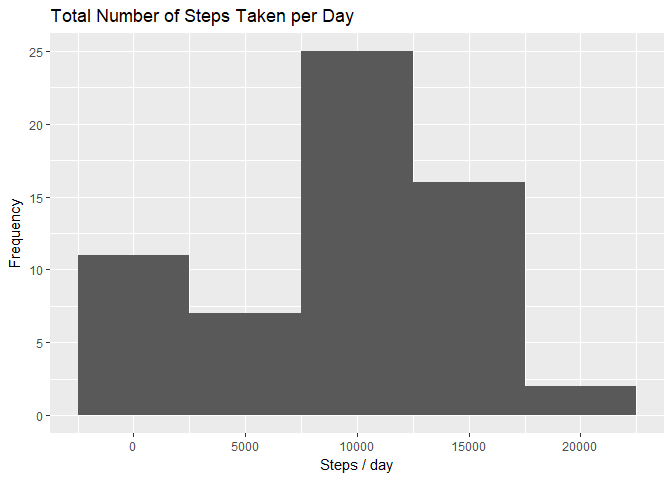
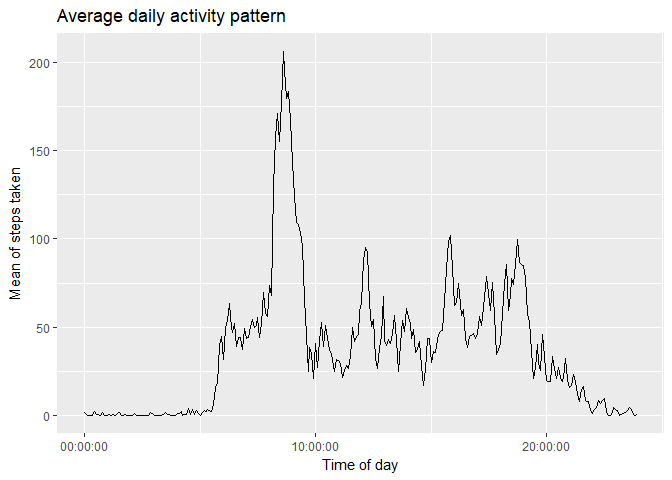
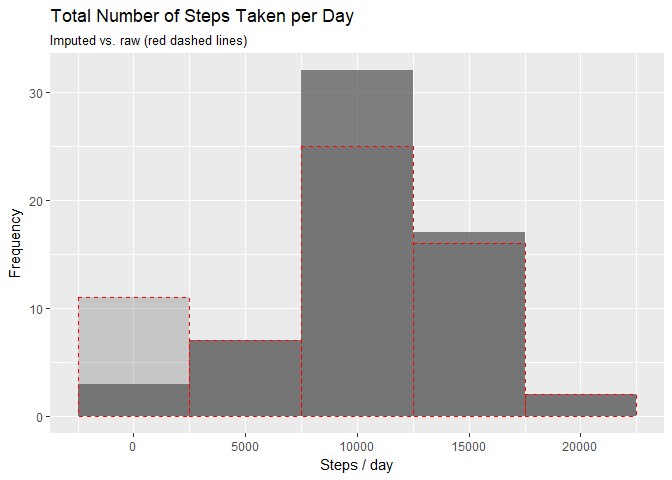
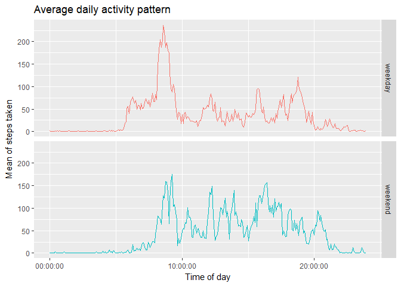

## Loading and preprocessing the data

First, load the necessary libraries.


```r
library(ggplot2)
library(stringr)
```

```
## Warning: package 'stringr' was built under R version 3.4.4
```

```r
library(hms)
```

```
## Warning: package 'hms' was built under R version 3.4.4
```


Then, load the dataset.


```r
if(!file.exists("activity.csv"))
        unzip("activity.zip")
activity <- read.csv("activity.csv", header = TRUE)
```


The data format for the variable `interval` is a bit of a mess, as it is given as integers representing hours (24 hour format) and minutes without leading zeros. Therefore, the `interval` value is left-padded with zeros and converted to class `difftime`.


```r
activity$date <- as.Date(activity$date)
activity$interval_difftime <- as.difftime(str_pad(activity$interval, 4, pad = "0"), "%H%M")
activity$wday <- as.POSIXlt(activity$date)$wday
```


We store weekday information with the dataset which will later be used for imputing (day of week) and for comparing weekday and weekend activity patterns.


```r
activity$day_type <- "weekday"
activity[activity$wday == 0 | activity$wday == 6, "day_type"] <- "weekend"
activity$day_type <- as.factor(activity$day_type)
```


## What is mean total number of steps taken per day?

*Note: For this question, we are ignoring the missing values in the dataset.*


```r
steps_per_day <- tapply(activity$steps, activity$date, sum, na.rm = TRUE)
g <- ggplot(mapping = aes(steps_per_day))
g + geom_histogram(binwidth = 5000) +
        labs(title = "Total Number of Steps Taken per Day") +
        xlab("Steps / day") +
        ylab("Frequency")
```

<!-- -->

For steps taken per day, the **mean is 9354** and the **median is 10395**.


```r
mean(steps_per_day)
```

```
## [1] 9354.23
```

```r
median(steps_per_day)
```

```
## [1] 10395
```

## What is the average daily activity pattern?

*Note: For this question, we are ignoring the missing values in the dataset.*


```r
interval_means <- aggregate(activity$steps, list(activity$interval_difftime), FUN = "mean", na.rm = TRUE)
names(interval_means) <- c("time", "steps_mean")
g <- ggplot(interval_means, mapping = aes(time, steps_mean))
g + geom_line() + 
        scale_x_time(name = "Time of day") +
        labs(title = "Average daily activity pattern") + 
        ylab("Mean of steps taken")
```

<!-- -->


The 5-minute interval which, on average across all the days in the dataset, contains the maximum number of steps (206 steps) begins at 08:35:00.


```r
as.hms(interval_means[which.max(interval_means$steps_mean),1])
```

```
## 08:35:00
```

```r
max(interval_means$steps_mean)
```

```
## [1] 206.1698
```


## Imputing missing values

Missing values in this dataset occur solely in the variable `steps` with a total number of 2304 NAs.


```r
summary(activity)
```

```
##      steps             date               interval      interval_difftime
##  Min.   :  0.00   Min.   :2012-10-01   Min.   :   0.0   Length:17568     
##  1st Qu.:  0.00   1st Qu.:2012-10-16   1st Qu.: 588.8   Class :difftime  
##  Median :  0.00   Median :2012-10-31   Median :1177.5   Mode  :numeric   
##  Mean   : 37.38   Mean   :2012-10-31   Mean   :1177.5                    
##  3rd Qu.: 12.00   3rd Qu.:2012-11-15   3rd Qu.:1766.2                    
##  Max.   :806.00   Max.   :2012-11-30   Max.   :2355.0                    
##  NA's   :2304                                                            
##       wday      day_type    
##  Min.   :0   weekday:12960  
##  1st Qu.:1   weekend: 4608  
##  Median :3                  
##  Mean   :3                  
##  3rd Qu.:5                  
##  Max.   :6                  
## 
```

```r
sum(is.na(activity$steps))
```

```
## [1] 2304
```


Our strategy will be to calculate mean steps taken per 5-minute interval for each day of the week, assuming that steps taken depends on time of day and day of the week. These means will be used to substitute NA values.


```r
interval_wday_means <- aggregate(activity$steps,
                                 list(activity$wday,activity$interval_difftime),
                                 FUN = "mean",
                                 na.rm = TRUE)
names(interval_wday_means) <- c("wday", "interval_difftime", "steps_mean")

impute_values <- merge(activity[is.na(activity$steps),],
                       interval_wday_means,
                       by=c("wday", "interval_difftime"))
```


Make sure that the original activity data.frame is sorted by time.


```r
sum(order(activity$date, activity$interval_difftime) != 1:dim(activity)[1])
```

```
## [1] 0
```

Create a new dataset that is equal to the original dataset but with the missing data filled in.


```r
activity_imputed <- activity
activity_imputed[is.na(activity$steps), "steps"] <-
        impute_values[order(impute_values$date, impute_values$interval_difftime), "steps_mean"]
```


Quickly verify that we got rid of all NAs.


```r
summary(activity_imputed)
```

```
##      steps             date               interval      interval_difftime
##  Min.   :  0.00   Min.   :2012-10-01   Min.   :   0.0   Length:17568     
##  1st Qu.:  0.00   1st Qu.:2012-10-16   1st Qu.: 588.8   Class :difftime  
##  Median :  0.00   Median :2012-10-31   Median :1177.5   Mode  :numeric   
##  Mean   : 37.57   Mean   :2012-10-31   Mean   :1177.5                    
##  3rd Qu.: 19.04   3rd Qu.:2012-11-15   3rd Qu.:1766.2                    
##  Max.   :806.00   Max.   :2012-11-30   Max.   :2355.0                    
##       wday      day_type    
##  Min.   :0   weekday:12960  
##  1st Qu.:1   weekend: 4608  
##  Median :3                  
##  Mean   :3                  
##  3rd Qu.:5                  
##  Max.   :6
```

```r
sum(is.na(activity_imputed$steps))
```

```
## [1] 0
```


The histogram on the imputed dataset shows significantly fewer instances with below 5,000 steps/day. This is reasonable since NAs were essentially treated as 0s before.


```r
steps_per_day_imputed <- tapply(activity_imputed$steps, activity$date, sum, na.rm = TRUE)
g <- ggplot(mapping = aes(steps_per_day_imputed))
g + geom_histogram(binwidth = 5000, alpha = 0.75) +
        geom_histogram(mapping = aes(steps_per_day),
                       binwidth = 5000,
                       color = "red",
                       alpha = 0.25,
                       lty="dashed") +
        labs(title = "Total Number of Steps Taken per Day",
             subtitle = "Imputed vs. raw (red dashed lines)") +
        xlab("Steps / day") +
        ylab("Frequency") +
        guides(override.aes = activity_imputed)
```

<!-- -->

Accordingly, mean and median of steps taken per day are higher than before imputing, specifically **1.0821\times 10^{4} for the mean** and **1.1015\times 10^{4} for the median**.


```r
mean(steps_per_day_imputed)
```

```
## [1] 10821.21
```

```r
median(steps_per_day_imputed)
```

```
## [1] 11015
```


## Are there differences in activity patterns between weekdays and weekends?


```r
interval_means_imputed <- aggregate(activity_imputed$steps,
                            list(activity_imputed$interval_difftime, activity_imputed$day_type),
                            FUN = "mean",
                            na.rm = TRUE)
names(interval_means_imputed) <- c("time", "day_type", "steps_mean")
g <- ggplot(interval_means_imputed, mapping = aes(time, steps_mean, colour = day_type))
g + geom_line() + 
        facet_grid(day_type ~ .) +
        scale_x_time(name = "Time of day") +
        labs(title = "Average daily activity pattern") + 
        ylab("Mean of steps taken") + 
        guides(col = FALSE)
```

<!-- -->

It can be noted that on weekends the active phase (with more steps taken per interval) occurs later in the day and the steps taken are more evenly distributed throughout the day as compared to weekdays.

Thanks for reading!
